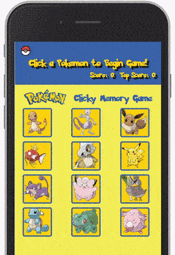

# Pokemon Memory Game - [React Site](http://oc-clicky-game.herokuapp.com/)
A memory style game. Each time you click on a Pokemon, the cards will shuffle and your score increases by 1. If you click on the same Pokemon twice, you lose! If your score beat the top score it will become the new top score, and the current score resets to 0.

## Screenshot

## Technologies/Frameworks used:
Here are the technologies that you need to install 
* [ReactJS](https://reactjs.org/) A JavaScript library for building user interfaces
* [Bootstrap](https://getbootstrap.com/) An open source toolkit for developing with HTML, CSS, and JS. 
* [Node.js](https://nodejs.org/en/) A JavaScript runtime built on Chrome's V8 JavaScript engine.
* Node Modules:
    * [Express](https://www.npmjs.com/package/express) Fast, unopinionated, minimalist web framework for node.

## State and Props
* State should be stored in a parent component with properties (or props) passed to child components.
* To change state from a child component, the parent component passes a function as a prop for the child to use.
* .setState({}) is used to modify the current state.

## Programmer's Notes
* Fisher-Yates Shuffle algorithm](https://github.com/coolaj86/knuth-shuffle) to shuffle an array of objects everytime a card is clicked.
* `.indexOf()` method to find the current index of Pokemon object array using the clicked Pokemon's **ID**, which we then modify the specific object's `clicked` value to `true`.

